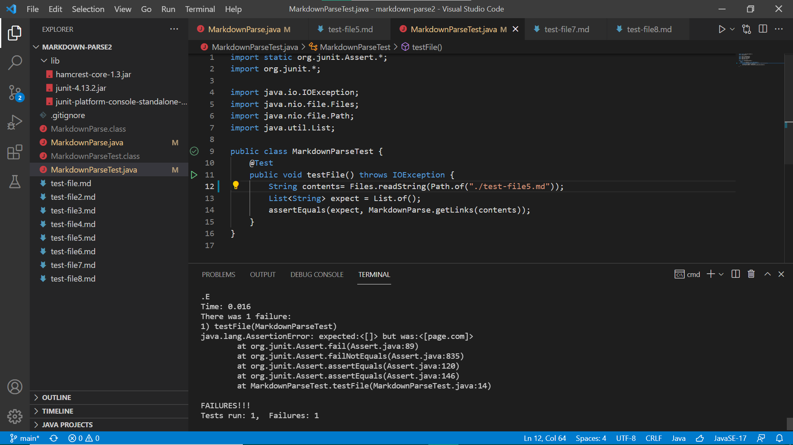
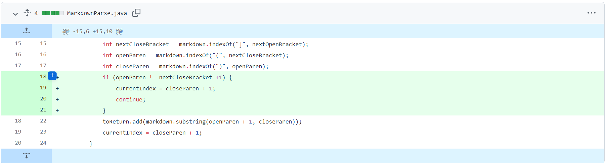
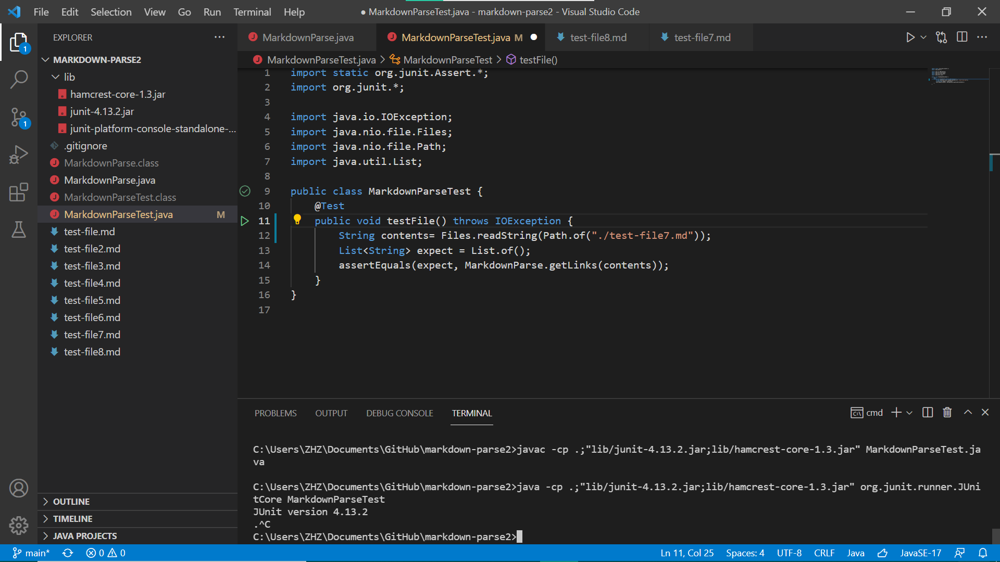
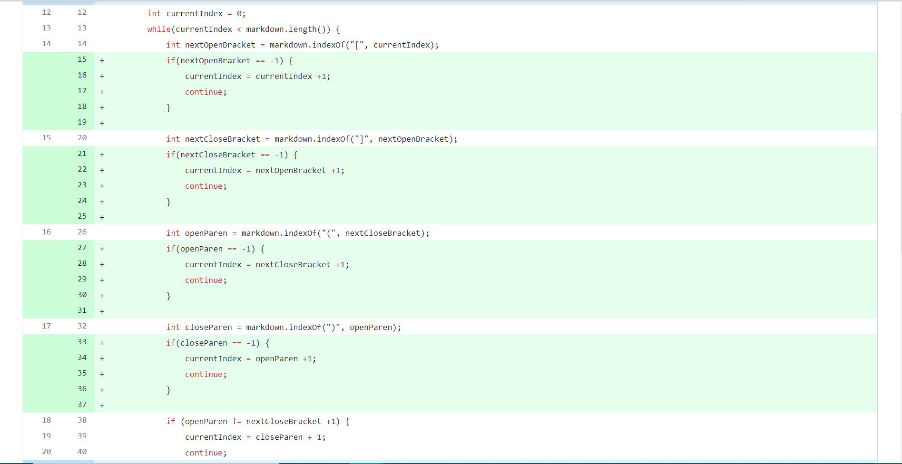
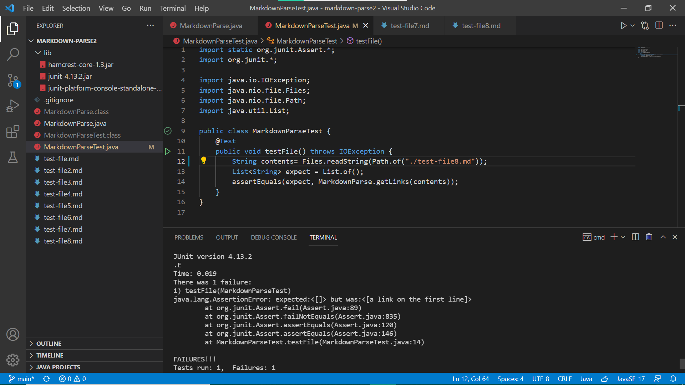
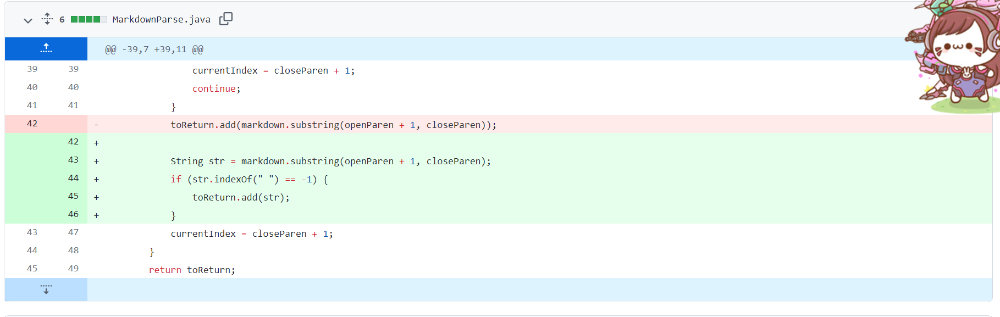

# Lab report 2
---
## First change to fix error
It is the test file No.5 that cause the error, and [here](https://github.com/Excalibur021/markdown-parse/blob/main/test-file5.md) is the link for the test file 5.

The symptom for this input is we expect an empty output, but it gives out "page.com" as the picture below shows.

Hence, we do the following change to the code

In this error, the bug beneath it is the original code did not check whether there are other characters between the close bracket and open paranthesis: if the open paranthesis is not the next character after the close bracket, then what in the paranthesis is not a link. In test file 5, there is another line between brackets and paranthesis. The code did not check it, so it assumes the text in paranthesis is a link, which is not. Hence, the bug and the input together produce the syptoms, which is the code gives out "page.com" where should be empty.

---
## Second change to fix error
It is the test file No.7 that cause the error, and [here](https://github.com/Excalibur021/markdown-parse/blob/main/test-file7.md) is the link for the test file 7.

The symptom for this input is we expect an empty output, but it goes into an infinite loop as the picture below shows.

Hence, we do the following change to the code

In this error, the bug beneath it is if there is no close paranthesis after the open paranthesis, then `markdown.indexOf(")", openParen)` will return -1, and cause the updated `currentIndex` to be 0 in every loop. In test file 7, there is only `)[` in the file. Hence, as says before, `currentIndex` will always be 0 in every loop, resulting the infinite loop as seen in symptoms.

---
## Third change to fix error
It is the test file No.5 that cause the error, and [here](https://github.com/Excalibur021/markdown-parse/blob/main/test-file8.md) is the link for the test file 8.

The symptom for this input is we expect an empty output, but it gives out "a link on the first line" as the picture below shows.

Hence, we do the following change to the code

In this error, the bug beneath it is the original code did not check whether the text between paranthesis is really a link or only a normal string. In test file 8, the text looks like ``. The text in paranthesis is not a link but only a normal String. The code didn't check it, so it has a symptom when input test file 8: it prints out "a link on the first line" instead of empty.

---

