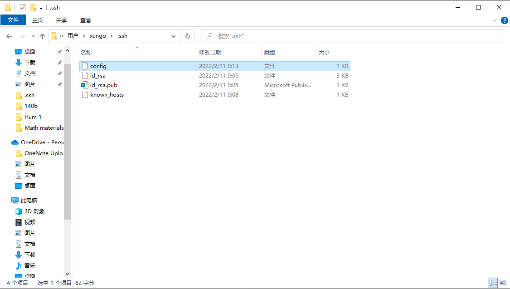

# Streamlining ssh Configuration
## The `.ssh/config` file is created in `.ssh` folder. 

---
## We can edit it with Visual Studio Code as the following pictures shows.

---
## After correctly configuring, we can use `ssh` commnad logging into account using alias

---
## We can also use `scp` to copy files to server using just the alias
