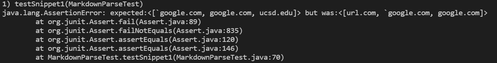
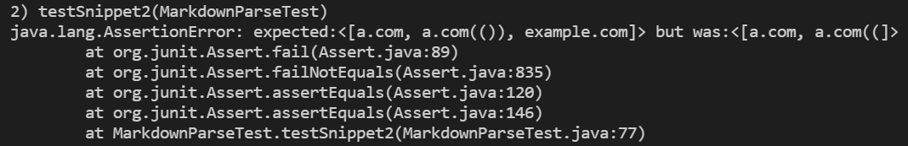
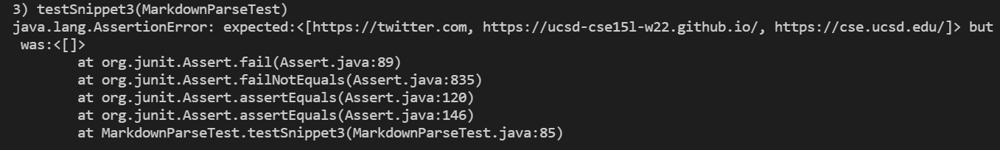
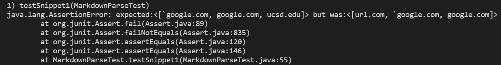
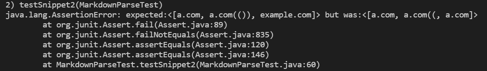
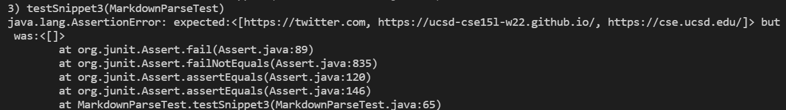

# Lab Report 4
## repo links
[My Own Implementation](https://github.com/Excalibur021/markdown-parse)

[This is his origin repo](https://github.com/leo3friedman/markdown-parse)
However, I cannot make commit to his repo nor fork it. Hnece, I import it to a new repo of mine and make some small changes to JUnit test file. [Here is my new repo, which is basiclly the same of original one](https://github.com/Excalibur021/markdown-parse-leo3friedman)

---
## JUnit Test Result
### My own
#### Snippet 1

Yes, there can be a small change. We can find the index of all `` ` ``, and if a pair of `` ` `` enclose part of the url syntax, we do not treat it as a link.
#### Snippert 2

It will be fairly hard to correct it with a small change. Nested paranthesis is annoying ---- it's hard to tell whether it's a nested paranthesis or only part of parenthesis or it missing some paranthesis. Those complicated situations may need a whole new method to check.
#### Snippert 3

Yes it can be small change. We can just ignore new line since it do not have much influence.
### Reviewed
#### Snippert 1

#### Snippert 2

#### Snippert 3
