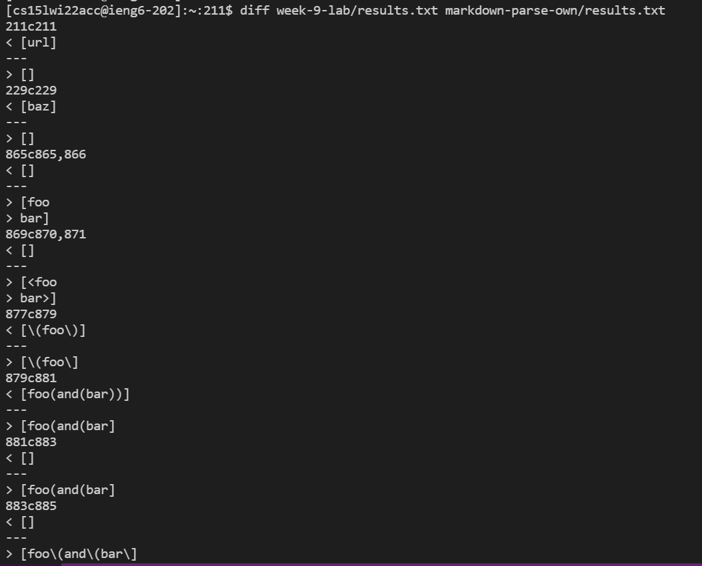
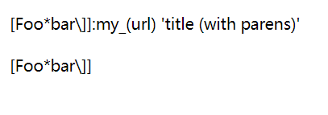
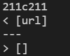
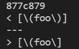
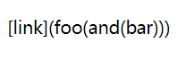
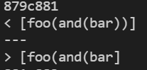
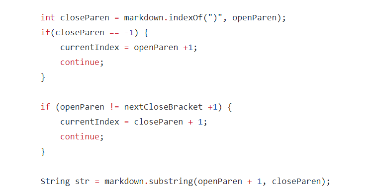

# Week 5 Lab Report

## Difference

I use `bash` to output each result to `results.txt` and use `diff` function on ieng6 server to find out the difference between the two files. The left is Prof.'s implementation and result on the right is my own. As shown below:

## Test - 1
The file is `test-files/193.md`. The raw file is

.

The expected output is `my_(url)`

The actual output for both implementation is

Both implementation are incorrect. The bug in my code is that I do not recogonized HTML grammar and find out links written in HTML format. In order to fix this, we should add a part of code to the program to recogonize links in HTML format.

## Test - 2
The file is `test-files/494.md`. The raw file is

The expected output should be `(foo)`

But actual outputs are

Both implementation is incorrect. The bug in Prof.'s impletation is: `\` should be ignored in the link but it did not. We should add a part of code remove `\` in the link

## Test - 3
The file is `test-files/495.md`. The raw file is

The expected output should be `foo(and(bar))`

But actual outputs are

The Prof.'s implementation is correct but mine is not. The bug is the nested parenthesis is not handled correctly. 

Here is the code need to be changed

We should not directly find the first close parenthesis and get String between it and first open parenthesis. This does not take nested parenthesis into consider.