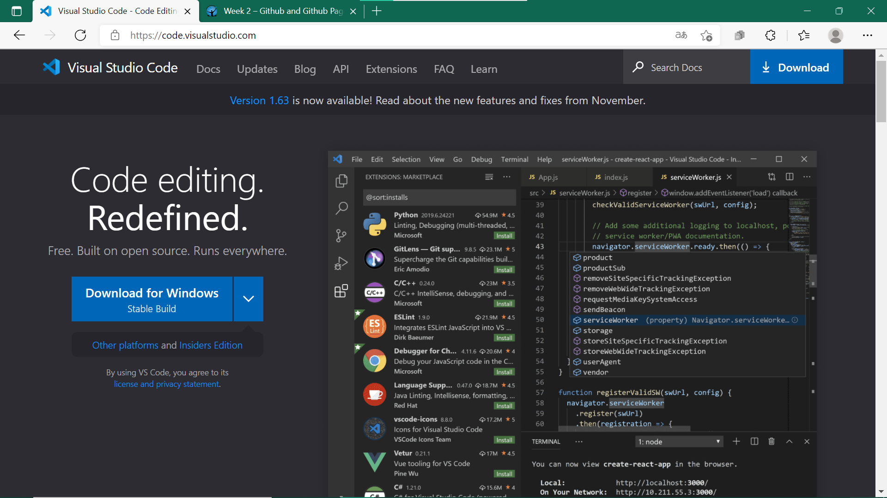
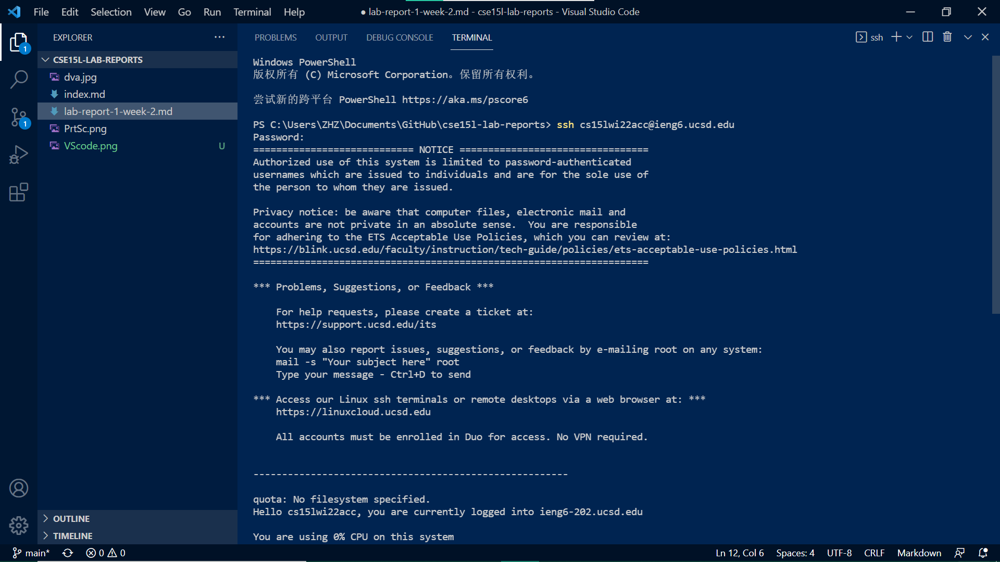
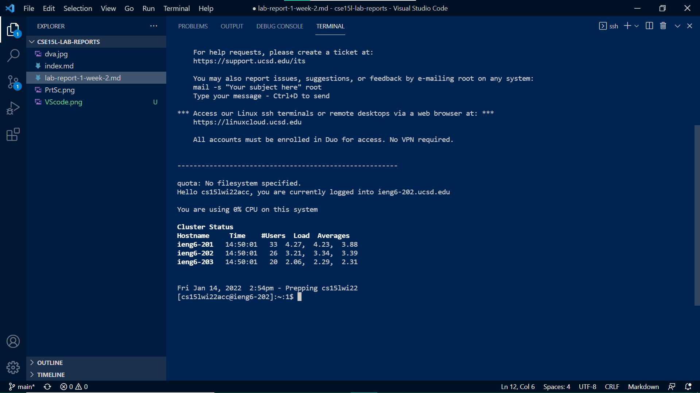
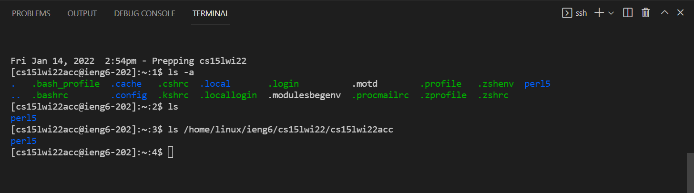
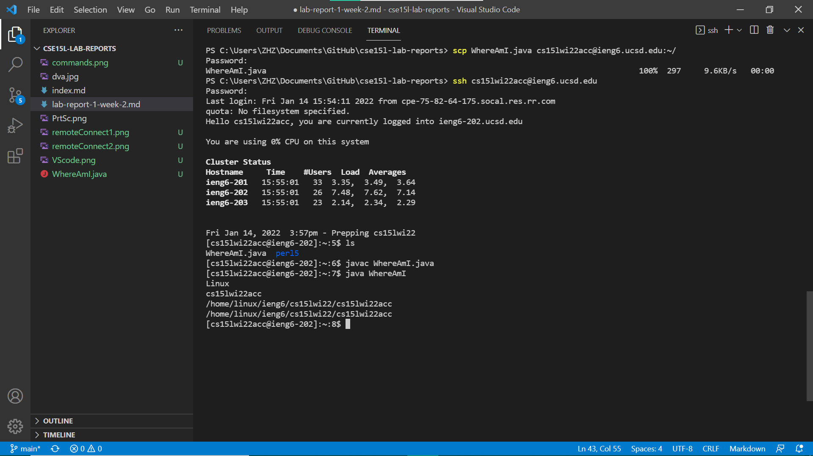
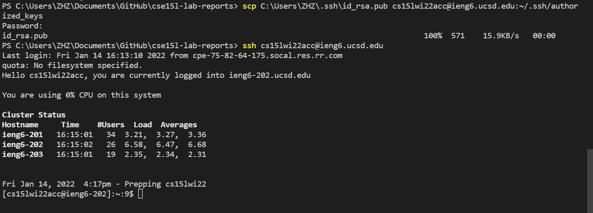
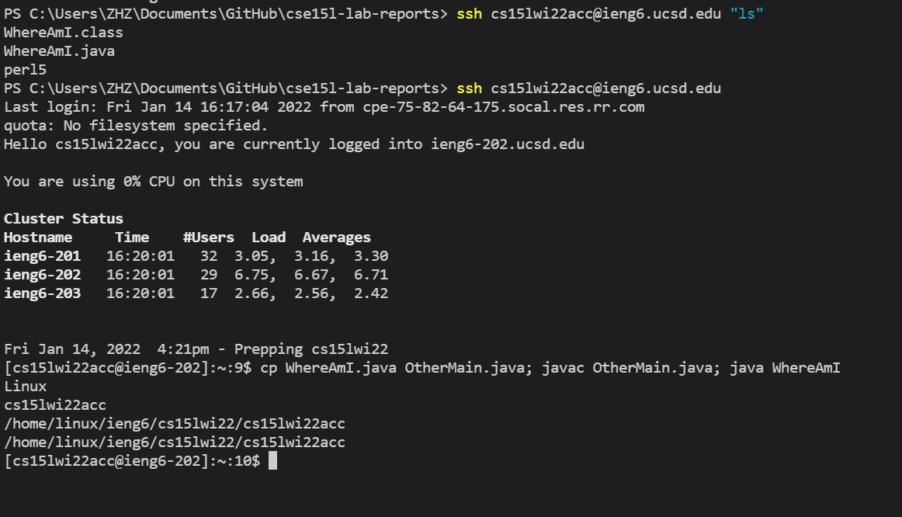

# Lab Report 1   (Week 2)

## Visual Studio Code download

Go to VScode website [https://code.visualstudio.com/](https://code.visualstudio.com/) to download the app to your own computer.


## Remote connecting

First go to [https://sdacs.ucsd.edu/~icc/index.php](https://sdacs.ucsd.edu/~icc/index.php) to check your own personal CSE 15L course specific account and change/setup the password for it. 

Then open a terminal in VS code, and type 

`ssh cs15lwi22acc@ieng6.ucsd.edu`

only with "cs15lwi22acc" changed with your own account. Then type your password and enter. Type "yes" if he ask you do you trust it.  After connecting succsessfully, it should look like screenshot below.




## commands

Now we try some Unix commands. Here is a cheat sheet for some Unix commands
[command cheat sheet](http://www.mathcs.emory.edu/~valerie/courses/fall10/155/resources/unix_cheatsheet.html).
For example, `ls -a` will list all files. `cp` will copy a file to another file or directory.


## moving files with `scp`

On your own computer, create a file named `WhereAmI.java` with following code in it:

```
class WhereAmI {
  public static void main(String[] args) {
    System.out.println(System.getProperty("os.name"));
    System.out.println(System.getProperty("user.name"));
    System.out.println(System.getProperty("user.home"));
    System.out.println(System.getProperty("user.dir"));
  }
}
```

Then in terminal and in the same directory of the file, write `scp WhereAmI.java cs15lwi22acc@ieng6.ucsd.edu:~/` (still substitute with your own account) and input your password. Then the file should be moved to the server. Now you can use `ls` to see the file on server and can use `javac` and `java` to complile and run it.



## set SSH key

On your own computer, run `ssh-keygen` (continuosly press "enter" with default setting and no passphrase for key). Then log onto the server and run 

`scp C:\Users\ZHZ\.ssh\id_rsa.pub cs15lwi22acc@ieng6.ucsd.edu:~/.ssh/authorized_keys`

subsitute with your own file location and account. The you can log on without password



## make it more pleasant

You can write commands in quotes after the log onto the server command to run it directly on server and the quit.

You can also write multiple commands in one line with semicolon seperate them.

